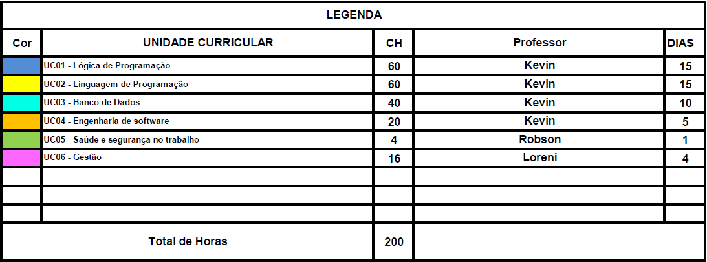
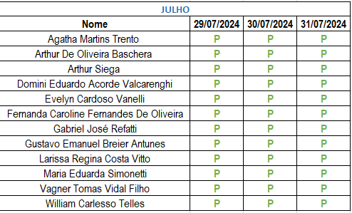
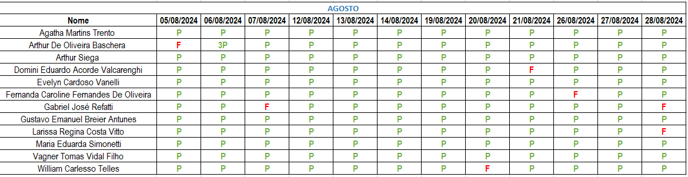
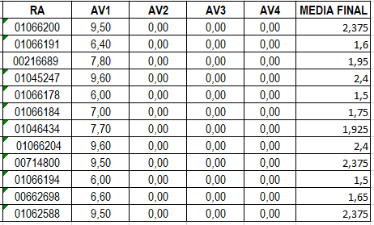

# Curso de Programador de Sistemas

Bem-vindo ao repositório do Curso de Programador de Sistemas oferecido pelo SENAI! Este repositório contém todos os materiais necessários para as aulas das disciplinas de Lógica de Programação, Linguagem de Programação, Banco de Dados e Engenharia de Software.

## Disciplinas

- **Lógica de Programação**
- **Linguagem de Programação**
- **Banco de Dados**
- **Engenharia de Software**

## Atividades do Beecrowd
Realizar as atividades 
1000 até 1043
1049|1050|1051|1059|1060|1065|1066|1070|1146|3301 

## Estrutura dos Diretórios

Cada disciplina possui um diretório próprio onde estarão disponíveis todos os materiais necessários, incluindo aulas, códigos de exemplo, exercícios e provas que serão realizados no decorrer do curso.

```
/Curso-Programador-de-Sistemas
│
├── Logica-de-Programacao
│ ├── aulas
│ ├── exemplos
│ ├── exercicios
│ └── provas
│
├── Linguagem-de-Programacao
│ ├── aulas
│ ├── exemplos
│ ├── exercicios
│ └── provas
│
├── Banco-de-Dados
│ ├── aulas
│ ├── exemplos
│ ├── exercicios
│ └── provas
│
└── Engenharia-de-Software
├── aulas
├── exemplos
├── exercicios
└── provas
```

## Calendário

Confira o calendário das disciplinas no arquivo anexo [Calendário Programador de Sistemas](https://github.com/KevinSGuimaraes/ProgramadorDeSistemas/blob/main/Calend%C3%A1rio%20Programador%20de%20Sistemas.pdf).

# Critérios e Procedimentos de Faltas


Resumo de Presenças e Faltas Permitidas

Para garantir 75% de presença, o aluno pode ter no máximo as seguintes faltas:
Lógica de Programação

    Dias mínimos de presença: 12 dias
    Máximo de faltas em aulas: 15 aulas
    Máximo de faltas em dias: 3 dias

Linguagem de Programação

    Dias mínimos de presença: 12 dias
    Máximo de faltas em aulas: 15 aulas
    Máximo de faltas em dias: 3 dias

Banco de Dados

    Dias mínimos de presença: 8 dias
    Máximo de faltas em aulas: 10 aulas
    Máximo de faltas em dias: 2 dias

Saúde e Segurança do Trabalho

    Dias mínimos de presença: 1 dia
    Máximo de faltas em aulas: 1 aula
    Máximo de faltas em dias: 0 dias

Gestão

    Dias mínimos de presença: 3 dias
    Máximo de faltas em aulas: 4 aulas
    Máximo de faltas em dias: 1 dia
	
# Lista de Presença




# Lista de Presença


## Como Usar este Repositório

1. Clone este repositório para o seu ambiente local:
    ```
    git clone https://github.com/KevinSGuimaraes/ProgramadorDeSistemas.git
    ```
2. Navegue até a pasta da disciplina desejada.
3. Siga as instruções e utilize os materiais disponíveis para cada aula.

## Contato

Para dúvidas ou mais informações, entre em contato com o instrutor:
- **Nome do Instrutor**: Kevin Guimarães
- **Email**: kevinguimaraes.trabalho@gmail.com